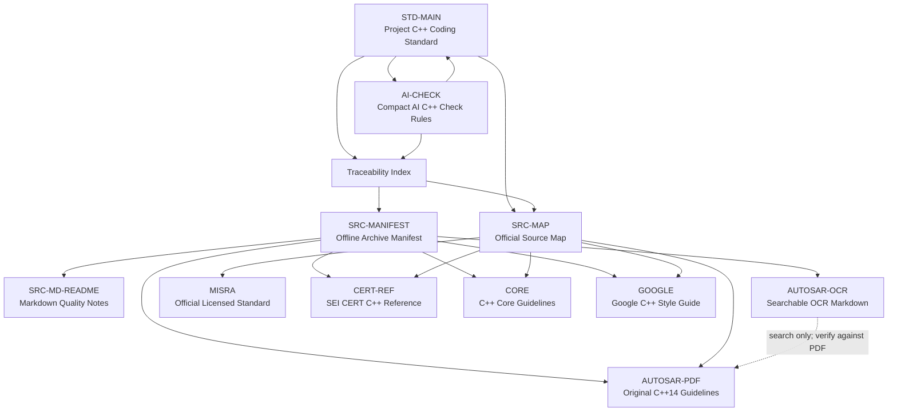

# Vehicle Embedded Linux C++ Standards Traceability Index

Purpose: keep the project C++ coding standard connected to its source material
without copying offline archives, licensed standards, OCR output, or long
reference text into the enforceable standard.

This file is an index and coverage map. It is not a replacement for AUTOSAR,
MISRA, SEI CERT C++, the C++ Core Guidelines, Google C++ Style Guide, or the
local offline archive.

Tags: #cpp-standard #automotive #embedded-linux #traceability #obsidian

## How To Use This Index

When an AI assistant or human reviewer updates the coding standard:

1. Read the main standard:
   [vehicle-embedded-linux-cpp-coding-standard.md](../vehicle-embedded-linux-cpp-coding-standard.md).
2. For coding tasks, read the compact AI check rules:
   [ai-vibe-coding-cpp-check-rules.md](../ai-vibe-coding-cpp-check-rules.md).
3. Read the stable source map:
   [vehicle-embedded-linux-cpp-standards-sources.md](vehicle-embedded-linux-cpp-standards-sources.md).
4. Read the offline manifest:
   [manifest.md](../offline-sources/manifest.md).
5. Use this traceability index to decide whether a source topic is already
   represented by an enforceable project rule.
6. Add or change main-standard rules only when the source material changes a
   project policy, coding constraint, review gate, or AI-generation constraint.

Do not paste long excerpts from source material into the main standard. Keep
source facts, archive quality notes, and graph/index information here.

## Source Nodes

| Node | Local Or Official Source | Role In This Project |
| :--- | :--- | :--- |
| `STD-MAIN` | [vehicle-embedded-linux-cpp-coding-standard.md](../vehicle-embedded-linux-cpp-coding-standard.md) | Enforceable project rules for product C++ code. |
| `AI-CHECK` | [ai-vibe-coding-cpp-check-rules.md](../ai-vibe-coding-cpp-check-rules.md) | Compact AI vibe coding checklist and token-budget workflow. |
| `SRC-MAP` | [vehicle-embedded-linux-cpp-standards-sources.md](vehicle-embedded-linux-cpp-standards-sources.md) | Stable list of official URLs, access notes, and AI rebuild prompt. |
| `SRC-MANIFEST` | [manifest.md](../offline-sources/manifest.md) | Current offline archive inventory and quality classification. |
| `SRC-MD-README` | [README.md](../offline-sources/md/README.md) | Notes about retained Markdown source quality and excluded material. |
| `AUTOSAR-PDF` | [autosar-cpp14-guidelines.pdf](../offline-sources/pdf/autosar-cpp14-guidelines.pdf) | Primary local automotive C++14 safety-subset reference. |
| `AUTOSAR-OCR` | [autosar-cpp14-guidelines.pdf_by_PaddleOCR-VL-1.6.md](../offline-sources/pdf/autosar-cpp14-guidelines.pdf_by_PaddleOCR-VL-1.6.md) | Searchable OCR extraction; useful for discovery, not authoritative for audits. |
| `MISRA` | Official links in `SRC-MAP` | Licensed compliance baseline; keep rule text out of this repository unless rights permit. |
| `CERT-REF` | [sei-cert-cpp-reference.md](../offline-sources/md/sei-cert-cpp-reference.md) | Curated security category and usage reference. |
| `CORE` | [cpp-core-guidelines.md](../offline-sources/md/cpp-core-guidelines.md) | Full local Markdown copy of C++ Core Guidelines. |
| `GOOGLE` | [google-cpp-style-guide.md](../offline-sources/md/google-cpp-style-guide.md) | Local Markdown conversion of Google C++ Style Guide. |

## Coverage Matrix

| Source Area | Main-Standard Coverage | Covered Project Intent | Intentionally Not Duplicated |
| :--- | :--- | :--- | :--- |
| AUTOSAR C++14 safety subset | Sections 1, 2, 4, 6, 7, 8, 11, 13, 17, 19, 20 | C++14 baseline, safety subset, deterministic behavior, static analysis gates, deviation process, restricted language features. | AUTOSAR rule text, examples, change tables, full A/M rule catalog, and OCR artifacts. |
| AUTOSAR rule classification and compliance model | Sections 2, 3, 4, 17, 19, 20, 21 | Priority rules, must/should language, tool checks, review checklist, deviation record, commercial compliance evidence. | Full obligation/enforcement tables and per-rule trace data. |
| MISRA C++ compliance | Sections 2, 4, 19, 20, 21 | Licensed-standard precedence, static-analysis gating, customer/Tier-1 readiness, deviation evidence. | Licensed MISRA rule text, examples, and proprietary PDFs. |
| SEI CERT C++ security categories | Sections 8, 11, 13, 14, 15, 17, 19 | Explicit errors, integer safety, memory and lifetime safety, POSIX boundary handling, secure input parsing, logging, DoS resistance. | Full CERT rule catalog and obsolete 2016 PDF content. |
| C++ Core Guidelines philosophy | Sections 1, 5, 6, 7, 8, 9, 10, 11, 12, 17 | RAII, explicit ownership, interface clarity, lifetime safety, type safety, resource management, concurrency discipline, testability. | Long examples, GSL profiles, historical discussion, myths, FAQ, and bibliography. |
| Google C++ Style Guide | Sections 6, 16, 18, 19 | Header hygiene, include order, naming, comments, formatting, scoped `auto`, lambda limits, casts, exceptions, RTTI, AI output constraints. | Google-specific build assumptions, large style examples, cpplint detail, and local exceptions unrelated to this project. |
| Offline manifest and Markdown quality notes | Intro, Section 18, Section 22, this file | Stable local archive discovery, source quality awareness, AI update workflow. | Raw capture history and removed low-signal pages. |
| Source map and rebuild prompt | Intro, Section 18, Section 22, this file | Official source URLs, access constraints, AI rebuild instructions, maintenance rules. | Full source content and repeated source summaries. |
| AI vibe coding check rules | Section 18, Section 22, `AI-CHECK` | Compact operational gates, token-budget stages, P0/P1 checks, prompt patterns, verification response shape. | Full coding standard text and offline source summaries. |
| AUTOSAR OCR Markdown | This file only | Search helper for locating topics before checking the original PDF. | OCR text as normative evidence; embedded HTML/OCR formatting defects. |

## Current Coverage Gaps

These topics are known and intentionally not expanded in the main standard until
the project needs stricter module-level rules:

- Per-rule AUTOSAR/MISRA mapping table.
- Approved C++17 feature whitelist.
- GSL usage policy, including `span`, `not_null`, and `owner`.
- Third-party library intake and approval checklist.
- `thread_local`, internal linkage, and static initialization policy.
- Forward declaration versus include policy beyond the current header-hygiene
  rule.
- Detailed copy/move/default-argument/implicit-conversion rules.
- `iostream`, regex, random number, and standard-library subset details.
- Module-specific Linux wrapper API requirements.

If one of these gaps becomes enforceable project policy, add the rule to the
main standard and update the coverage matrix in this file.

## Obsidian Wikilinks

Use these links in Obsidian to keep the standard, source map, offline archive,
and traceability index connected:

- [[vehicle-embedded-linux-cpp-coding-standard]]
- [[ai-vibe-coding-cpp-check-rules]]
- [[vehicle-embedded-linux-cpp-standards-sources]]
- [[vehicle-embedded-linux-cpp-standards-traceability]]
- [[manifest]]
- [[cpp-core-guidelines]]
- [[google-cpp-style-guide]]
- [[sei-cert-cpp-reference]]
- [[autosar-cpp14-guidelines.pdf_by_PaddleOCR-VL-1.6]]

## Obsidian Relationship Graph

## AI Update Rules

- Keep `STD-MAIN` concise and enforceable.
- Keep source inventory, coverage analysis, and graph links in this file.
- Use `SRC-MAP` for official URLs and access constraints.
- Use `SRC-MANIFEST` for the list of retained local files.
- Use `AUTOSAR-PDF`, not OCR text, as the local authoritative AUTOSAR artifact.
- Treat MISRA as a licensed source: summarize project policy and compliance
  process only.
- When adding a new source, update `SRC-MAP`, `SRC-MANIFEST` if archived
  locally, and this file's source nodes and coverage matrix.
