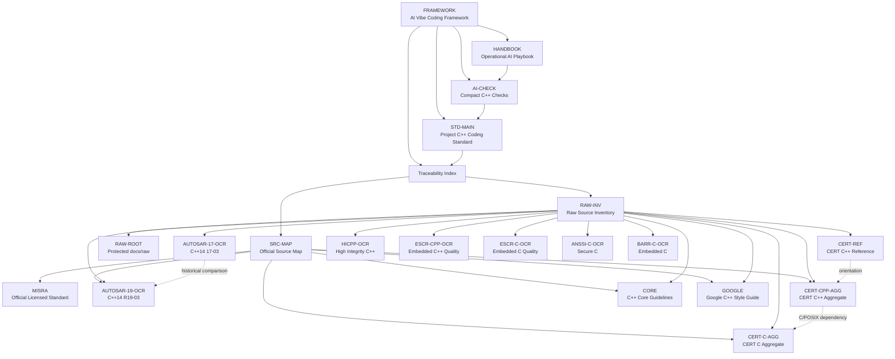

# Vehicle Embedded Linux C++ Standards Traceability Index

Purpose: keep the project C++ coding standard connected to source material
without copying raw archives, licensed standards, OCR output, or long reference
text into enforceable rules.

This file is an index and coverage map. It is not a replacement for AUTOSAR,
MISRA, SEI CERT C/C++, C++ Core Guidelines, Google C++ Style Guide, HICPP, ESCR,
ANSSI, Barr-C, or the local raw archive.

Tags: #cpp-standard #automotive #embedded-linux #traceability #obsidian

## How To Use This Index

When an AI assistant or human reviewer updates the coding standard:

1. Read the framework:
   [ai-vibe-coding-framework.md](../ai-vibe-coding-framework.md).
2. Read the main standard:
   [vehicle-embedded-linux-cpp-coding-standard.md](../vehicle-embedded-linux-cpp-coding-standard.md).
3. For coding tasks, read the compact AI check rules:
   [ai-vibe-coding-cpp-check-rules.md](../ai-vibe-coding-cpp-check-rules.md).
4. Read the stable source map:
   [vehicle-embedded-linux-cpp-standards-sources.md](vehicle-embedded-linux-cpp-standards-sources.md).
5. Read the raw source inventory:
   [raw-source-inventory.md](raw-source-inventory.md).
6. Use this traceability index to decide whether a source topic is already
   represented by an enforceable project rule.
7. Search `docs/raw/` only for targeted source evidence. Do not modify
   `docs/raw/` or `skills/`.

Do not paste long excerpts from source material into the main standard. Keep
source facts, archive quality notes, and graph/index information here.

## Source Nodes

| Node | Local Or Official Source | Role In This Project |
| :--- | :--- | :--- |
| `FRAMEWORK` | [ai-vibe-coding-framework.md](../ai-vibe-coding-framework.md) | Top-level AI vibe coding framework and routing model. |
| `HANDBOOK` | [ai-coding-product-grade-handbook.md](../ai-coding-product-grade-handbook.md) | Operational AI coding playbook. |
| `AI-CHECK` | [ai-vibe-coding-cpp-check-rules.md](../ai-vibe-coding-cpp-check-rules.md) | Compact AI C++ checklist and token-budget workflow. |
| `STD-MAIN` | [vehicle-embedded-linux-cpp-coding-standard.md](../vehicle-embedded-linux-cpp-coding-standard.md) | Enforceable project rules for product C++ code. |
| `SRC-MAP` | [vehicle-embedded-linux-cpp-standards-sources.md](vehicle-embedded-linux-cpp-standards-sources.md) | Official URLs, access notes, and AI rebuild prompt. |
| `RAW-INV` | [raw-source-inventory.md](raw-source-inventory.md) | Current read-only raw archive inventory and quality classification. |
| `RAW-ROOT` | [docs/raw](../raw) | Protected raw archive root. Search/read only; do not modify. |
| `MISRA` | Official links in `SRC-MAP` | Licensed compliance baseline; keep rule text out of this repository unless rights permit. |
| `AUTOSAR-19-OCR` | [autosar-cpp14-guidelines.pdf_by_PaddleOCR-VL-1.6.md](../raw/offline-sources/pdf/autosar-cpp14-guidelines.pdf_by_PaddleOCR-VL-1.6.md) | AUTOSAR C++14 R19-03 searchable OCR; primary local AUTOSAR OCR. |
| `AUTOSAR-17-OCR` | [autosar-cpp14-2017.pdf_by_PaddleOCR-VL-1.6.md](../raw/offline-sources/pdf/autosar-cpp14-2017.pdf_by_PaddleOCR-VL-1.6.md) | AUTOSAR C++14 17-03 searchable OCR for historical comparison. |
| `CERT-CPP-AGG` | [sei-cert-cpp-secure-coding-aggregate.md](../raw/offline-sources/md/sei-cert-cpp-secure-coding-aggregate.md) | High-signal CERT C++ aggregate reference. |
| `CERT-C-AGG` | [sei-cert-c-secure-coding-aggregate.md](../raw/offline-sources/md/sei-cert-c-secure-coding-aggregate.md) | High-signal CERT C aggregate for C/POSIX boundaries. |
| `CERT-REF` | [sei-cert-cpp-reference.md](../raw/offline-sources/md/sei-cert-cpp-reference.md) | Curated CERT C++ access and category reference. |
| `CERT-CPP-2016-OCR` | [sei-cert-cpp-2016.pdf_by_PaddleOCR-VL-1.6.md](../raw/offline-sources/pdf/sei-cert-cpp-2016.pdf_by_PaddleOCR-VL-1.6.md) | SEI CERT C++ 2016 searchable OCR for source-detail lookup. |
| `CERT-C-2016-OCR` | [sei-cert-c-2016.pdf_by_PaddleOCR-VL-1.6.md](../raw/offline-sources/pdf/sei-cert-c-2016.pdf_by_PaddleOCR-VL-1.6.md) | SEI CERT C 2016 searchable OCR for source-detail lookup. |
| `CORE` | [cpp-core-guidelines.md](../raw/offline-sources/md/cpp-core-guidelines.md) | Full local Markdown copy of C++ Core Guidelines. |
| `GOOGLE` | [google-cpp-style-guide.md](../raw/offline-sources/md/google-cpp-style-guide.md) | Local Markdown extraction of Google C++ Style Guide. |
| `HICPP-OCR` | [hi-cpp-4.0.pdf_by_PaddleOCR-VL-1.6.md](../raw/offline-sources/pdf/hi-cpp-4.0.pdf_by_PaddleOCR-VL-1.6.md) | Supplemental high-integrity C++ safety/style reference. |
| `ESCR-CPP-OCR` | [escr-cpp-3.0.pdf_by_PaddleOCR-VL-1.6.md](../raw/offline-sources/pdf/escr-cpp-3.0.pdf_by_PaddleOCR-VL-1.6.md) | Supplemental embedded C++ quality reference; filename/version caveat in inventory. |
| `ESCR-C-OCR` | [escr-c-3.0.pdf_by_PaddleOCR-VL-1.6.md](../raw/offline-sources/pdf/escr-c-3.0.pdf_by_PaddleOCR-VL-1.6.md) | Supplemental embedded C quality reference. |
| `ANSSI-C-OCR` | [anssi-fr-c-v1.4.pdf_by_PaddleOCR-VL-1.6.md](../raw/offline-sources/pdf/anssi-fr-c-v1.4.pdf_by_PaddleOCR-VL-1.6.md) | Supplemental secure C reference. |
| `BARR-C-OCR` | [barr-c-2018.pdf_by_PaddleOCR-VL-1.6.md](../raw/offline-sources/pdf/barr-c-2018.pdf_by_PaddleOCR-VL-1.6.md) | Supplemental embedded C style/reference material. |

## Coverage Matrix

| Source Area | Main-Standard Coverage | Covered Project Intent | Intentionally Not Duplicated |
| :--- | :--- | :--- | :--- |
| AI vibe coding workflow | Section 18, Section 22, `FRAMEWORK`, `HANDBOOK`, `AI-CHECK` | Tool entry routing, token budget, P0/P1 checks, response shape, verification evidence, protected raw/skills policy. | Full skill docs and raw source summaries. |
| AUTOSAR C++14 safety subset | Sections 1, 2, 4, 6, 7, 8, 11, 13, 17, 19, 20 | C++14 baseline, restricted language features, deterministic behavior, static analysis gates, deviation process. | AUTOSAR rule text, examples, change tables, full A/M rule catalog, OCR artifacts. |
| AUTOSAR compliance model | Sections 2, 3, 4, 17, 19, 20, 21 | Must/should language, tool checks, review checklist, deviation record, commercial compliance evidence. | Full obligation/enforcement tables and per-rule trace data. |
| MISRA C++ compliance | Sections 2, 4, 19, 20, 21 | Licensed-standard precedence, static-analysis gating, customer/Tier-1 readiness, deviation evidence. | Licensed MISRA rule text, examples, and proprietary PDFs. |
| SEI CERT C++ security families | Sections 7, 8, 10, 11, 12, 13, 14, 17, 19 | Explicit errors, lifetime safety, memory/resource safety, type safety, containers, OOP, concurrency, secure input parsing. | Full CERT rule catalog, analyzer tables, long examples. |
| SEI CERT C and secure C references | Sections 8, 11, 13, 14, 17, 19 | C API boundaries, POSIX wrappers, signals, strings, buffers, file I/O, environment, trust boundaries. | Full C rule text, long examples, complete analyzer matrices. |
| C++ Core Guidelines philosophy | Sections 1, 5, 6, 7, 8, 9, 10, 11, 12, 17 | RAII, explicit ownership, interface clarity, lifetime safety, type safety, resource management, concurrency discipline, testability. | Long examples, GSL profiles, historical discussion, myths, FAQ, bibliography. |
| Google C++ Style Guide | Sections 6, 16, 18, 19 | Header hygiene, include order, naming, comments, formatting, scoped `auto`, lambda limits, casts, exceptions, RTTI, AI output constraints. | Google-specific build assumptions, large style examples, cpplint detail. |
| HICPP | Sections 3, 4, 6, 7, 10, 11, 16, 17, 19 | High-integrity enforceability, deviation discipline, object lifetime, conversions, concurrency, standard-library restrictions. | Full HICPP rule text and examples. |
| ESCR C/C++ | Sections 1, 5, 12, 16, 17, 19 | Embedded code quality, readability, maintainability, portability, module sizing, coding-convention structure. | Full ESCR practice charts and examples. |
| ANSSI and Barr-C | Sections 13, 14, 16, 17, 19 | Secure C/C boundary constraints, macros, undefined behavior, compiler hardening, embedded C style and review discipline. | Full secure C and embedded C rule catalogs. |
| Raw source inventory | Intro, Section 18, Section 22, `RAW-INV` | Stable raw archive discovery, source quality awareness, AI update workflow. | Raw capture history and OCR body text. |
| Source map and rebuild prompt | Intro, Section 18, Section 22, `SRC-MAP` | Official source URLs, access constraints, AI rebuild instructions, maintenance rules. | Full source content and repeated summaries. |

## Current Coverage Gaps

These topics are known and intentionally not expanded in the main standard until
the project needs stricter module-level rules:

- Per-rule AUTOSAR/MISRA/CERT/HICPP mapping table.
- Approved C++17 feature whitelist.
- GSL usage policy, including `span`, `not_null`, and `owner`.
- Third-party library intake and approval checklist.
- `thread_local`, internal linkage, and static initialization policy.
- Forward declaration versus include policy beyond current header hygiene.
- Detailed copy/move/default-argument/implicit-conversion rules.
- `iostream`, regex, random number, and standard-library subset details.
- Module-specific Linux wrapper API requirements.
- Tool-specific static-analysis profile mapping beyond `.clang-tidy`.

If one of these gaps becomes enforceable project policy, add the rule to the
main standard and update this coverage matrix.

## Obsidian Wikilinks

Use these links in Obsidian to keep framework, standard, source map, raw archive,
and traceability connected:

- [[ai-vibe-coding-framework]]
- [[ai-coding-product-grade-handbook]]
- [[ai-vibe-coding-cpp-check-rules]]
- [[vehicle-embedded-linux-cpp-coding-standard]]
- [[vehicle-embedded-linux-cpp-standards-sources]]
- [[vehicle-embedded-linux-cpp-standards-traceability]]
- [[raw-source-inventory]]
- [[cpp-core-guidelines]]
- [[google-cpp-style-guide]]
- [[sei-cert-cpp-reference]]
- [[sei-cert-cpp-secure-coding-aggregate]]
- [[sei-cert-c-secure-coding-aggregate]]
- [[autosar-cpp14-guidelines.pdf_by_PaddleOCR-VL-1.6]]
- [[autosar-cpp14-2017.pdf_by_PaddleOCR-VL-1.6]]
- [[hi-cpp-4.0.pdf_by_PaddleOCR-VL-1.6]]

## Obsidian Relationship Graph

## AI Update Rules

- Keep `FRAMEWORK`, `HANDBOOK`, and `AI-CHECK` compact and operational.
- Keep `STD-MAIN` concise and enforceable.
- Keep source inventory, coverage analysis, and graph links in this file and
  `RAW-INV`.
- Use `SRC-MAP` for official URLs and access constraints.
- Treat MISRA and other licensed standards as access-controlled sources:
  summarize project policy and compliance process only.
- Treat OCR files as search aids, not normative text.
- Prefer aggregate references before OCR files.
- Do not modify `docs/raw/` or `skills/`.
- When adding a new source, update `SRC-MAP`, `RAW-INV`, this file's source
  nodes, coverage matrix, Obsidian links, and graph.
